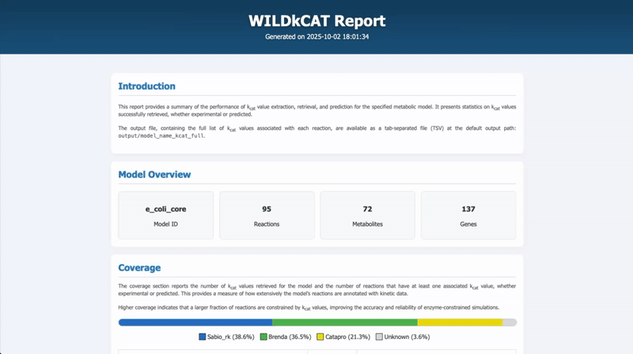

**WILDkCAT** is a Python package that offers a comprehensive range of functions for extracting, retrieving and predicting enzyme kinetic data for a given metabolic model. The tool facilitates enzyme-constrained modelling by assigning specific kcat values to each combination of reaction, enzyme, and substrate(s).

WILDkCAT integrates the **[BRENDA](https://www.brenda-enzymes.org/)** and **[SABIO-RK](https://sabiork.h-its.org/)** APIs to retrieve experimental values and **[CataPro](https://github.com/zchwang/CataPro)** to predict missing values. It can be used with various enzyme-constrained metabolic modelling methods, such as **[COBREXA.jl](https://github.com/COBREXA/COBREXA.jl)** and **[GECKO](https://github.com/SysBioChalmers/GECKO)**, facilitating the seamless integration of kcat values into a given metabolic model.

---

WILDkCAT also generates HTML reports at each step of the process, providing insights into the data retrieval and prediction outcomes: 

  

___ 